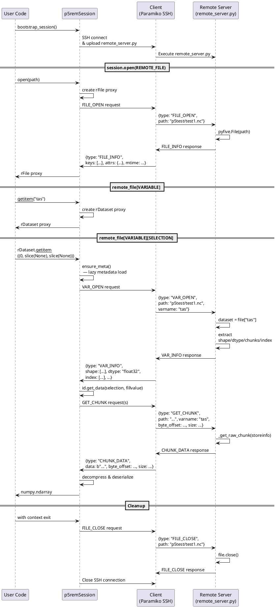

# p5rem Protocol Documentation

## Protocol Overview

p5rem communicates over a binary CBOR-framed protocol via SSH stdio. Messages are prefixed with a 4-byte little-endian length field, followed by CBOR-encoded payload. Here we demonstrate the usage of the protocol in a simple read remote slice example.

### Message Types

This example uses the following message types

- **FILE_OPEN** / **FILE_INFO** — Open a file, retrieve top-level keys and attributes
- **VAR_OPEN** / **VAR_INFO** — Open a variable, retrieve shape, dtype, chunks, and chunk index
- **GET_CHUNK** / **CHUNK_DATA** — Request raw chunk bytes by offset/size
- **LIST** / **LIST_RESULT** — List directory contents
- **STAT** / **STAT_RESULT** — Get file/directory metadata (size, mtime, mode, etc.)
- **FILE_CLOSE** — Release file handle
- **HEARTBEAT** — Keepalive message
- **ERROR** — Error response (used for all failures)

There is also a slot in the protocol for supporting remote reductions
via PyActiveStorage.

## Example: read_remote_slice.py

The following sequence diagram illustrates a complete read operation, including
starting and stopping a session:

### Key Design Points

1. **Lazy Evaluation** — Proxies (rFile, rDataset) avoid network traffic until data is actually accessed
2. **Metadata Caching** — Variable metadata is cached by mtime to avoid re-fetching
3. **Streaming Chunks** — Large data transfers happen via GET_CHUNK/CHUNK_DATA pairs, enabling partial reads
4. **pyfive Index** — Server extracts the HDF5 chunk index and sends it to the client, enabling intelligent chunk location
5. **Binary Efficiency** — CBOR serialization + length-prefix framing minimizes overhead

Client-side chunk cache support is available, but not used in this example.
